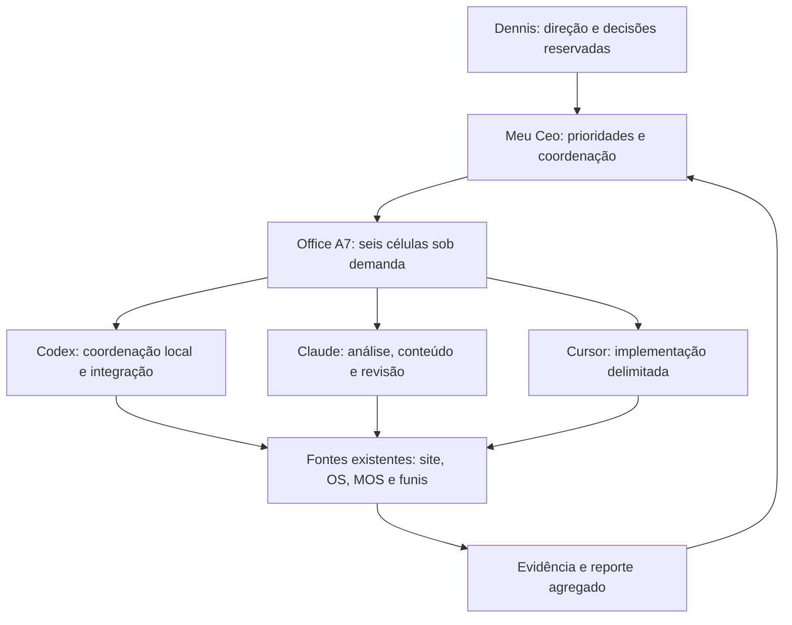

# A7 Laundry Orlando — departamento operado com IA

Preparado em 13/09/2026 para Dennis e Meu Ceo. Story: [A7-044](../stories/a7-044-ai-office-department-prompt.md).

**Entrega atual: desenho do departamento, prompt mestre e pacotes de trabalho.** Este diretório é o contrato local do office. A fila, o estado e o runner continuam no Meu Ceo. As rotinas pausadas continuam pausadas; os pacotes abaixo ainda não foram executados por Claude ou Cursor.

## Começar por aqui

- [Prompt mestre](PROMPT-MESTRE.md): instrução completa para Meu Ceo coordenar a preparação e uma implantação por etapas.
- [Pacotes Claude e Cursor](PACOTES-CLAUDE-CURSOR.md): responsabilidades e entregas distintas, prontas para encaminhar.
- [Reporte ao Meu Ceo](REPORTE-MEU-CEO.md): situação encontrada, prioridades e próximo passo.

## Resultado de negócio

Nenhum lead observado sem responsável, etapa, próxima ação e prazo. Cada pedido deve preservar origem, confirmação operacional, pagamento e entrega. O indicador principal proposto é **contribuição dos pedidos pagos e entregues no prazo**, segmentada por origem quando a atribuição for comprovada.

“100% IA” é a direção de automação da gestão e do trabalho digital repetível. Coleta, lavagem, conferência física e entrega precisam de execução e evidência da unidade. Atendimento autônomo e disponibilidade contínua ainda precisam de implantação comprovada; um prompt não os ativa. Não existe garantia de converter 100% dos interessados.

## Estrutura a reaproveitar

Ferramenta não equivale a cargo ou autoridade. O mesmo executor pode assumir funções em entregas diferentes; revisão independente continua necessária quando o risco justificar. Preservar autoridades AIOS: @sm/@po em stories, @architect em arquitetura, @qa no parecer de qualidade e @devops em push/PR/release.

| Célula existente | Responsável funcional / executor inicial proposto | Entrega e passagem de trabalho | Indicador de resultado |
|---|---|---|---|
| Direção e oferta | Coordenador A7 / Codex; Claude analisa hipóteses | Escolhe um gargalo e entrega brief com segmento, oferta canônica, prova e aceite para Aquisição/Conteúdo | Prioridades concluídas e contribuição observável |
| Aquisição local e paga | Responsável de aquisição / Codex; Claude pesquisa e propõe copy | Canal → destino → CTA → origem rastreável; proposta de alteração com evidência para revisão | Leads qualificados, clientes novos pagos e CAC calculável |
| Conteúdo | Responsável editorial / Claude; Codex integra ativos | Brief → roteiro/peça → revisão → publicação autorizada → aprendizado; respeita produção guest existente | Peças utilizadas e resultados atribuíveis; volume é indicador auxiliar |
| Conversão e operação | Responsável operacional A7 / Codex; Cursor corrige fluxos | Triagem, fatos faltantes e próxima ação; OS confirma pedido, capacidade e execução | Leads sem dono, tempo de resposta, aceites e entregas no prazo |
| Receita e retenção | Responsável de receita / Codex; Claude prepara relacionamento | Pagamento conciliado, custos conhecidos e coorte; proposta de pós-venda no contexto correto | Contribuição, recompra e indicação observadas |
| Dados e qualidade | Revisor independente @qa / Codex ou Claude conforme autoria | Confere fonte, janela, integridade e aceite; devolve aprovar/corrigir com evidência | Dados atuais, atribuição conhecida e retrabalho |

Começar com até duas entregas independentes e uma revisão sob demanda, como configuração proposta. Um integrador e um escritor por conjunto de arquivos. A disponibilidade de tokens não cria demanda artificial.

| Célula | Entrada e acionamento | Frequência / prazo de controle proposto |
|---|---|---|
| Direção e oferta | Direção de Dennis, dado novo ou mudança de capacidade | Revisão semanal e mudança relevante; cada prioridade recebe prazo na fila |
| Aquisição local e paga | Brief aceito, dado do canal ou falha de destino | Ciclo autorizado e revisão semanal; incidente recebe prioridade pelo impacto |
| Conteúdo | Brief, prova e capacidade de produção confirmados | Conforme calendário vigente e prazo da entrega; produção respeita pausas |
| Conversão e operação | Novo contato, pendência ou evento do OS | Por evento e abertura/fechamento; backup de atendimento aos 5 minutos conforme playbook |
| Receita e retenção | Pagamento/entrega confirmados e custos disponíveis | Reconciliação no fechamento e análise semanal; relacionamento conforme elegibilidade |
| Dados e qualidade | Nova observação ou entrega para aceite | Toda conclusão e ciclo autorizado, antes de decisões que dependam do dado |

## Fontes e propriedade

| Domínio | Fonte existente | Regra de uso |
|---|---|---|
| Oferta e promessas | [MANIFESTO](../../MANIFESTO.md), `a7-business-config.js`, `config/orlando-operations.json` | Manifesto prevalece; divergência vira correção identificada |
| Atendimento | [Playbook](../../marketing/PLAYBOOK-ATENDIMENTO.md), `marketing/whatsapp/message-templates.md` | Reusar qualificação, backup aos 5 minutos e D+1/D+3; envio respeita autorização e contexto |
| Identidade de páginas e campanhas | `governance/content-registry.mjs`, `marketing/funnel-intelligence/` | Atualizar autoria na origem; derivados não viram cadastro paralelo |
| Clientes, leads, pedidos e eventos | Orlando OS, serviços `lib/system-*.js`, ledger operacional | Dados pessoais permanecem protegidos no sistema de origem |
| Medição | MOS e plataformas de origem | Distinguir fonte, janela, moeda, tráfego de teste e horário de coleta |
| Coordenação | [Office central](</Users/dennisarruda/Documents/ChatGPT/Meu Ceo/marketing/a7-orlando/office/OFFICE.md>) | `fila.json`, `state.json`, `observations/`, `runs/` e `run-office.mjs` permanecem centrais |
| Criativos guest | `Meu Ceo/marketing/a7-orlando/40-reels-guest/` | Preservar calendário, versão, produção de Dennis e mandatos mais recentes |

Não é necessário criar outro projeto ou CRM agora. Este contrato liga o projeto existente à central. Uma transferência futura de fila/runtime exige migração explícita, um único escritor e troca do consumidor central; copiar diretórios não conclui essa migração.

## Funil e responsabilidades

| Etapa | Evidência para avançar | Dono da passagem |
|---|---|---|
| Origem e contato | Origem registrada quando disponível; contato real; clique isolado não cria venda | Aquisição → Conversão |
| Lead e qualificação | Referência durável; serviço, local atendível, prazo, volume/contexto e mínimo esclarecidos | Conversão; fatos não confirmados permanecem pendentes |
| Aceite do pedido | Confirmação operacional no serviço existente, com capacidade e janela | Operação da unidade |
| Coleta e pesagem | Eventos e peso confirmados na origem | Operação da unidade |
| Invoice e pagamento | Documento vigente e confirmação financeira reconciliada | Operação → Receita |
| Produção e entrega | Eventos operacionais e evidência de conclusão | Operação da unidade |
| Relacionamento | Entrega confirmada, elegibilidade/contexto de contato e autorização aplicável | Receita/retenção → Conversão |

Pagamento e produção seguem as regras reais do OS; a tabela não cria uma nova ordem obrigatória de eventos. Não marcar pago por print de cliente nem entregue por previsão. B2B, moradores e hóspedes têm segmentos separados; recompra de turista não é receita garantida.

## Rotina proposta para a retomada

1. **Por evento de lead:** registrar/conciliar uma vez, atribuir dono, identificar falta de informação e preparar próxima ação. Até o canal oficial estar validado, manter atendimento existente e revisão humana. O playbook prevê backup após 5 minutos sem resposta humana; heartbeat horário não atende esse prazo.
2. **Por ciclo central autorizado:** ler mudanças, conferir atualidade das fontes, selecionar trabalho pronto, executar dentro do mandato, revisar e registrar. Sem mudança acionável, encerrar sem aviso repetido. Uma falha de leitura fica como indisponibilidade, não como zero atividade.
3. **Abertura e fechamento operacional:** conferir pendências, capacidade, pagamentos e entregas; preparar D+1/D+3 conforme playbook e elegibilidade. Horários devem seguir a jornada real, ainda não presumida.
4. **Revisão semanal:** decidir manter, corrigir ou encerrar cada experimento com janela comparável, custos e capacidade; transformar procedimento comprovado em script ou skill quando reduzir retrabalho.

Cadência é proposta, não automação criada. Reutilizar o heartbeat central existente quando houver retomada explícita. Para continuidade fora do computador local, primeiro especificar e provar hospedagem, autenticação, recuperação de falhas e monitor externo. Agendamentos locais que dependem de arquivos exigem computador ligado e aplicativo em execução. [Documentação oficial](https://learn.chatgpt.com/docs/automations?surface=app).

## Medição mínima

| Medida | Definição |
|---|---|
| Cobertura de leads observados | Leads elegíveis com dono e próxima ação / leads elegíveis observados na mesma janela; objetivo de controle: 100% |
| Tempo de resposta | Contato inbound → primeira resposta humana/assistida efetiva; saudação automática não encerra o relógio |
| Conversão | Mostrar denominadores separados: contatos → qualificados → pedidos aceitos → pedidos pagos |
| CAC | Gasto de aquisição da coorte / clientes novos pagos atribuídos à mesma coorte; sem denominador ou atribuição, `null` |
| Contribuição | Receita de serviço conciliada líquida de refunds − custos variáveis conhecidos; gorjetas separadas; lacunas tornam o valor `null` |
| Entrega no prazo | Pedidos entregues dentro do compromisso confirmado / entregas elegíveis; informar também pedidos vencidos ainda abertos |
| Recompra e indicação | Clientes com novo pedido pago distinto / clientes elegíveis da coorte na janela definida; indicações somente com origem comprovada, separadas por guest, resident e B2B |
| Eficiência de IA | Entregas aceitas, tempo até aceite, retrabalho, intervenções e consumo observado por ferramenta |

Preservar moeda e período. Não dividir gasto Meta de um mês por receita OS de sete dias, nem usar receita GA4 como prova financeira. Metas comerciais numéricas serão definidas após linha de base; não inventar ROI, capacidade ou custo por cliente.

## Implantação por evidência

| Etapa | Resultado exigido antes da seguinte |
|---|---|
| Preparação atual | Prompt, papéis, fontes, pacotes e reporte revisados; estado da central preservado |
| Piloto documental recomendado | Uma entrega de preparação vinculada à fila central: seis cenários sintéticos de lead guest, proposta comercial Claude, leitura de contratos Cursor e revisão Codex; zero alteração operacional |
| Prontidão técnica | A7-014/025/028/029 e dependências revalidadas; backlog por story, decisões exigidas prontas para análise; implementar somente fatias liberadas |
| Operação assistida | Jornada real autorizada e observada de ponta a ponta; canal, identidade, financeiro, capacidade e retorno manual comprovados |
| Autonomia delimitada | Regras permitidas, limites de custo/ação, idempotência, recuperação, pausa e observabilidade aprovados e testados para cada ação |
| Expansão comercial | Crescer apenas quando pedido pago, contribuição e capacidade sustentarem a decisão |

Os cenários propostos são: Standard; Express sem capacidade confirmada; endereço não validado; valor mínimo ainda não explicado; webhook/evento repetido; pedido B2B fora da oferta guest. São cenários de exercício, não clientes reais nem teste comercial.

## Fotografia verificada em 13/09/2026

- Office central já possui seis células e IDs A7O-001 a A7O-013. Há evidência histórica de execução agendada parcial em 12/09; instruções posteriores registram central pausada em 13/09. Isso não prova operação contínua atual.
- A7-014 documenta ponte WhatsApp, com Coexistence pendente e agente automático desligado. A7-025 está Draft; A7-028 e A7-029 estão Draft/Blocked. Não há evidência nesta preparação de atendimento autônomo em produção.
- A7-040/041 registram trabalho local de dados em revisão. Priorizar reconciliação e confiança antes de ampliar mídia ou redesenhar o sistema inteiro.
- `claude --version` respondeu `2.1.212`; Codex CLI foi localizado. `Cursor.app` foi localizado em `/Applications`, mas `cursor` e `agent` não foram encontrados no PATH. Login, cota atual e execução desses pacotes não foram verificados.
- O dispatcher legado `.aios-core/core/execution/subagent-dispatcher.js` contém bypass de permissões. Ele não é o adaptador recomendado para o office; preservar permissões delimitadas e mecanismo suportado de cada ferramenta.

As conclusões acima são inspeção de arquivos e ferramentas locais. Não houve auditoria live de campanhas, clientes, receita ou canal nesta entrega.
